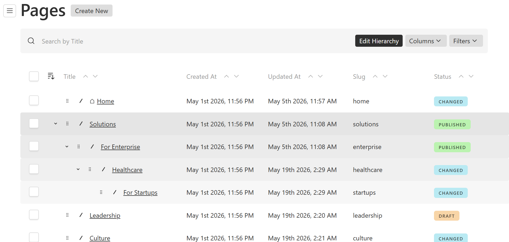
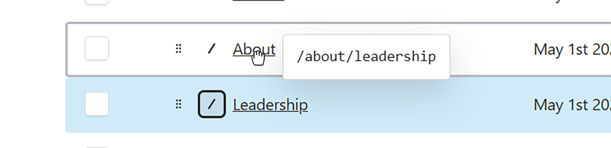
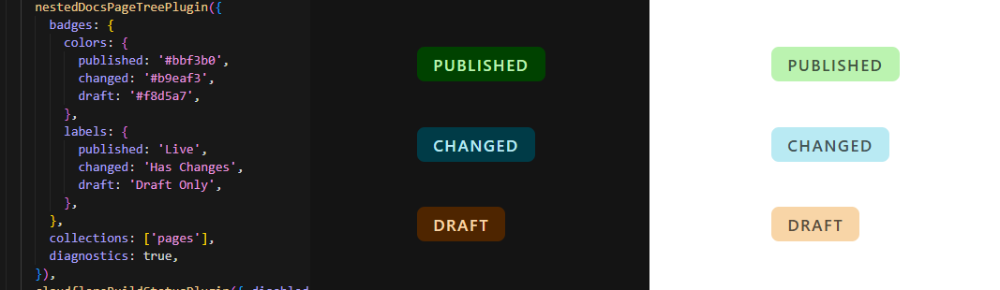
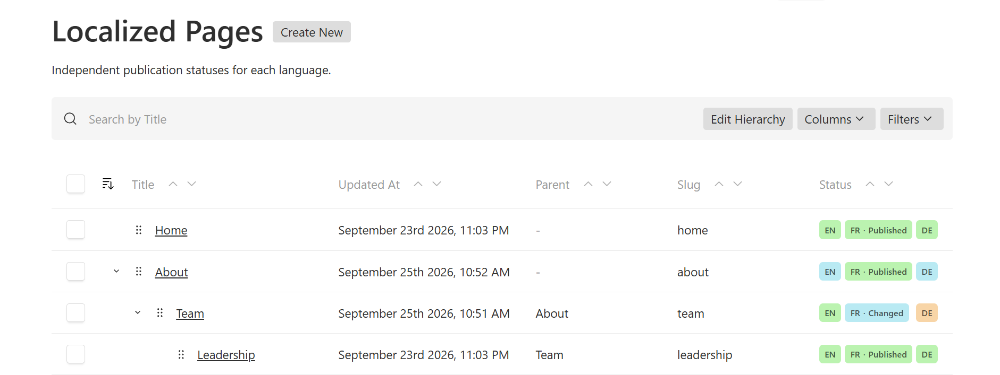
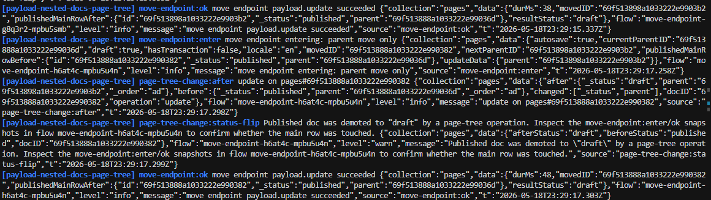

# payload-nested-docs-page-tree

Page management tools for Payload admin, built on [`@payloadcms/plugin-nested-docs`](https://payloadcms.com/docs/plugins/nested-docs).

- **Page tree UI** with hierarchy and page URL paths.
- **Intuitive drag and drop** to reorder siblings or move pages between parents.
- **Status badges** for published pages, drafts, and drafts with unpublished changes.
- **Localized status badges** to see each language's publication status and open the page editor in that language with one click.
- **Live and preview links** from badges, with separate destinations for changed pages.
- **Customizable badges** with label and color overrides for light and dark themes.
- **Homepage icon** to identify the root `home` page.
- **Publishing controls** to stage hierarchy changes or publish eligible moves immediately.
- **Diagnostics mode** to trace moves, reorders, and published-state changes.
- **Native list tools** including sorting, filters, pagination, bulk selection, and row actions.

**Coming soon:** custom badges for any cell.

[Page tree](#page-tree-ui) · [Drag and drop](#drag-and-drop) · [Badges](#badges) · [Localized status](#locale-status-badges) · [Live and preview links](#live-and-preview-links) · [Homepage icon](#homepage-icon) · [Diagnostics](#diagnostics) · [Full setup](#setup) · [Configuration](#configuration)

## Page tree UI



Browse nested pages while keeping Payload's sorting, filters, pagination, bulk selection, and row actions.

### Visual hierarchy


### Page URL paths



## Drag and drop

### Reorder siblings

https://github.com/user-attachments/assets/b25ffa1a-a6bd-45cf-bce8-56ba6cdf7e72

Requires Payload `orderable` and sorting by its order field. Drag the reorder handle within the same parent or root level; only the order key changes.

### Edit hierarchy

https://github.com/user-attachments/assets/618d5e53-5918-40be-9932-0f516e5e82ba

Enable **Edit Hierarchy** to move pages between parents using Payload's API and nested docs hooks.

### Move to a parent

https://github.com/user-attachments/assets/4cb25109-e515-4955-8503-39fddac0020f

Drop a page onto another page to make it a child.

### Move back to root

https://github.com/user-attachments/assets/470cb5b3-61c8-4b5b-a6e4-5e855f58a0e4

Drop between root pages to return a page to the root level.

### Same-parent reorder guard

https://github.com/user-attachments/assets/2513ff04-192e-4fdf-808f-6004f55d871c

Reordering stays within the current parent. Use **Edit Hierarchy** to change parents.

Moves are staged as drafts by default. Set `publishOnMove: true` to publish a move immediately **only when the page has no pending edits**. Collections without drafts always move live.

<details>
<summary>Publishing and locales</summary>

### Publishing moves

- Staged moves update the tree immediately; live paths change on publication.
- With `publishOnMove: true`, pages with pending edits still stay staged. Publishing a move also republishes descendants so their live URLs follow the new parent.
- On localized collections, the parent is shared but breadcrumbs are localized. Publishing a move updates breadcrumbs only in the active locale; other locales retain their previous URLs until published. Leave `publishOnMove` off if this does not suit your routing.

</details>

## Drag-And-Drop Is Triggering A Deploy?

If your `afterChange` hook triggers external work-deploys, notifications, or search indexing-skip tree writes that leave the published site unchanged:

```ts
import { pageTreeMoveContextKey } from 'payload-nested-docs-page-tree'

// At the start of your afterChange hook:
if (req.context?.[pageTreeMoveContextKey]) return
```

| Tree operation | Hook with this guard |
| --- | --- |
| Sibling reorder or staged move | Skipped |
| Published move | Runs once for the subtree |

The same guard works with or without `publishOnMove`. Without it, your hook may run on every drag, including staged changes. Hooks that only invalidate caches generally need no deploy guard.

See [the playground deploy hook](dev/lib/rebuild.ts) for a complete example. The plugin provides `POST /:id/move` and `POST /:id/reorder` endpoints for these interactions.

## Badges



| State | Meaning |
| --- | --- |
| `published` | Published and up to date |
| `changed` | Draft with a published version |
| `draft` | Not published |

Override any labels or colors with `badges`. Unspecified values use Payload defaults; custom colors adapt to light and dark themes.

### Locale status badges



See each page's publication status across languages directly in the page tree. Each language has its own color-coded badge showing whether the page is published, a draft, or has unpublished changes. Click a language badge to open that page's editor in the selected language, in the same tab.

The active language also shows its status label, such as **FR · Published** or **FR · Changed**. Other languages show their codes, such as **EN** and **DE**, with their own status colors. Badges line up across rows so editors can quickly scan for translations that need attention.

Set `badges.locales: true` to show one badge for each available locale:

```ts
nestedDocsPageTreePlugin({
  collections: ['pages'],
  badges: {
    locales: true,
    // Existing colors and labels apply independently to each status.
    labels: { changed: 'Unpublished edits' },
  },
})
```

For an editor using French, the badges appear side by side: **EN** | **FR · Unpublished edits** | **DE**.

Locale codes display in uppercase and follow the order in Payload's localization configuration, respecting `filterAvailableLocales`. Existing badge label and color overrides apply to each locale's status.

Badge links support keyboard navigation, include the language and status in their accessible names, and respect your configured admin route. Hidden badges preserve their aligned slots and cannot be clicked. Locale badges link to the editor independently of `badgesLinks`, which controls live and preview links on single status badges.

This requires Payload's native localized status, configured separately:

```ts
// Main Payload config
experimental: { localizeStatus: true },
localization: {
  defaultLocale: 'en',
  locales: ['en', 'fr', 'de'],
},

// Target collection
versions: {
  drafts: { localizeStatus: true },
},
```

Localized status is experimental in the supported Payload versions. Follow [Payload's status-localization and migration guidance](https://payloadcms.com/docs/configuration/localization#status-localization) before enabling it for existing data. The plugin does not enable it or migrate your database. Collections without localized status, or with `badges.locales` omitted, retain the existing single badge.

Statuses are read from the latest draft and current document, with locale fallback disabled:

| Latest locale status | Current locale status | Badge |
| --- | --- | --- |
| Published | Any | Published |
| Draft | Published | Unpublished edits |
| Draft | Draft or missing | Draft |
| Missing or unsupported | Any | Unknown (neutral) |

The plugin batches the two status reads across the tree result, respects read permissions, and does not fetch content separately for every badge.

#### Custom appearance

The plugin keeps the status calculation and layout reusable. Use these styling hooks to apply a project-specific appearance, such as seasonal colors and status icons:

- `.pages-hierarchy-locale-statuses`: the badge group.
- `.pages-hierarchy-locale-status-badge`: a badge, with `data-locale`, `data-status`, and `data-active`.
- `.pages-hierarchy-locale-status-badge__code`, `__separator`, and `__label`: the visible pieces.

For example, local admin CSS can assign a season color:

```css
.pages-hierarchy-locale-statuses .pages-hierarchy-locale-status-badge[data-locale='summer'] {
  background: #fff0a8;
  color: #594600;
}
```

A reskin can hide `__code` and `__separator` and add a status icon using the badge's `::before` and `data-status`, keeping the active status label and accessible name. The default plugin supplies no icons.

### Live and preview links


https://github.com/user-attachments/assets/e5fdb350-4740-4d80-9811-8c23deaf8701

Enable `badgesLinks` as shown in [Setup](#setup).

Published badges open live with a right-side link icon; draft-only badges open preview with a right-side eye icon. Because drafts with a published version has two (live and draft) states, choose:

| Value | Behavior |
| --- | --- |
| `'live'` | Whole badge, including the right-side link icon, opens live |
| `'preview'` | Whole badge, including the right-side eye icon, opens preview |
| `'both'` (default) | Body with link icon opens live; eye icon after a separator opens preview |

- **Live:** A string `liveURL` is the base URL for the published document's last breadcrumb path. Alternatively, pass a sync or async callback returning the final URL for tenant domains or localized routes. Omit `liveURL` for preview links only.
- **Preview:** Uses the collection's [`admin.preview`](https://payloadcms.com/docs/admin/preview) callback. Your frontend must serve draft content.

All live and preview links open in new tabs. Unlinked badges have no icon. Omit `badgesLinks` to keep single status badges unlinked, even with preview configured. Locale badges still link to the editor.

`badgesLinks.showIcons` defaults to `true`: live links use Payload's chain-link `LinkIcon`, and preview links use `EyeIcon`. Set it to `false` to hide inline badge icons; in `'both'` mode, the separate preview action still shows `ExternalLinkIcon` after the separator.

For example, with a `tenant` relationship on pages and a `domain` field on tenants:

```ts
badgesLinks: {
  liveURL: async ({ doc, locale, path, req }) => {
    if (!path || (typeof doc.tenant !== 'string' && typeof doc.tenant !== 'number')) {
      return null
    }

    const tenant = await req.payload.findByID({
      collection: 'tenants',
      id: doc.tenant,
      overrideAccess: false,
      req,
    })

    return new URL(`${locale ? `/${locale}` : ''}${path}`, `https://${tenant.domain}`).href
  },
},
```

The callback receives `{ collectionSlug, doc, locale, path, req }`. `doc` is the readable published document at depth `0`, so relationships contain IDs. `locale` is the selected admin locale, or `undefined` without localization. `path` is the last published breadcrumb URL from `breadcrumbsFieldSlug`, or `undefined` when unavailable. The callback can build its own route without breadcrumbs. It runs only when a live destination is needed and a readable published document exists, and stays on the server. The `PageTreeLiveURL` type is exported for standalone callbacks.

<details>
<summary>URL resolution and unavailable links</summary>

String live links use `breadcrumbsFieldSlug` and the published path, unaffected by draft slug or parent changes. Callback results are used as final URLs without appending the breadcrumb path. Relative callback URLs resolve against the CMS request URL; return an absolute URL for a separate frontend. Only HTTP and HTTPS links are accepted. Preview receives the latest saved draft, locale, request, and user token. Unsaved changes and `admin.livePreview.url` are not used.

Missing breadcrumbs for string live URLs, missing or invalid URLs, or a failing live or preview callback disable only that link. Return `null`, `undefined`, or an empty string from the live callback to leave the live destination unlinked. In `'both'` mode, no live URL leaves the body as text; no preview URL hides the icon. Single-link modes never switch destinations. The selected mode is independent of the badge label.

</details>

## Homepage icon


The homepage icon marks a **root page with slug `home`**. For custom collection slugs, use `homeIndicator: { collections: ['page-tree'] }`.

## Diagnostics



Set `diagnostics: true` and reproduce the issue. Logs group related events by `flow` and show before/after changes to status, parent, order, and the published row. Diagnostics adds database reads; enable it while investigating.

<details>
<summary>Log fields and custom logger</summary>

Events are tagged `[payload-nested-docs-page-tree]` and identify the move, reorder, or change-hook step. Key fields:

- `flow`: shared ID for one operation.
- `publishedMainRowBefore` / `publishedMainRowAfter`: published-row snapshots (`draft: false`).
- `before` / `after` / `changed`: projected status, parent, and order diffs.

A published row losing its `published` status produces a `page-tree-change:status-flip` warning.

```ts
diagnostics: {
  enabled: true,
  logger: (event) => console.log(event), // send to your preferred logger
},
```

</details>

## Setup

Tested with Payload `3.81` and Next.js `16.2`. Requires `@payloadcms/plugin-nested-docs`, which continues to own persistence and breadcrumb generation; your frontend owns routing.

```bash
pnpm add payload-nested-docs-page-tree
```

Register it **after** your existing nested docs plugin. This example shows every page-tree option, including optional badge styling and links:

```ts
import { nestedDocsPlugin } from '@payloadcms/plugin-nested-docs'
import { nestedDocsPageTreePlugin } from 'payload-nested-docs-page-tree'

export const plugins = [
  nestedDocsPlugin({ // Register first; keep your existing nested docs options.
    collections: ['pages'],
  }),
  nestedDocsPageTreePlugin({
    collections: ['pages'], // Required: collections to show as a tree.
    defaultLimit: 100, // Documents per list page.
    hideBreadcrumbs: true, // False to show the read-only breadcrumbs field.
    disabled: false, // True to disable the plugin.

    homeIndicator: { collections: ['pages'] }, // Mark the root "home" page; false disables it.

    badges: { // Omit to use Payload defaults.
      labels: { // Override any status label.
        published: 'Live',
        changed: 'Has Changes', // A draft with a published version.
        draft: 'Draft',
      },
      colors: { // Base colors adapt to light and dark themes.
        published: '#bbf3b0',
        changed: '#b9eaf3',
        draft: '#f8d5a7',
      },
    },

    badgesLinks: { // Omit to disable links; preview uses collection admin.preview.
      showIcons: true, // Default; false hides inline icons and keeps the split preview action.
      draftHasPublishedVersion: 'both', // 'live' | 'preview' | 'both'
      liveURL: 'https://www.example.com', // Base URL for the published breadcrumb path.
    },

    publishOnMove: false, // True publishes moves only for pages without pending edits.
    diagnostics: false, // True to trace moves, reorders, and status changes.
  }),
]
```

Only `collections` is required in the page-tree config. Omit `badges` for default styling and `badgesLinks` to disable live and preview links. Preview links require the collection's `admin.preview` callback.

Each target collection needs parent, breadcrumbs, and `admin.useAsTitle` fields stored at the document's top level. Presentational tabs, rows, collapsibles, and unnamed groups are supported; fields inside named tabs or groups are not.

Refresh the admin import map:

```bash
pnpm exec payload generate:importmap
```

## Configuration

| Option | Default | Purpose |
| --- | --- | --- |
| `collections` | Required | Target collection slugs |
| `parentFieldSlug` | `'parent'` | Nested docs parent field |
| `breadcrumbsFieldSlug` | `'breadcrumbs'` | Nested docs breadcrumbs field |
| `defaultLimit` | `100` | List page size |
| `hideBreadcrumbs` | `true` | Hide the read-only breadcrumbs field |
| `homeIndicator` | `{ collections: ['pages'] }` | Collections showing a home icon; `false` disables it |
| `badges` | Payload defaults | Status labels, colors, and optional locale badges |
| `badgesLinks` | Disabled | Live and preview links |
| `publishOnMove` | `false` | Publish moves for pages without pending edits |
| `diagnostics` | `false` | Structured operation logs |
| `disabled` | `false` | Disable the plugin |

## Development

<details>
<summary>Local playground, checks, and release validation</summary>

Source lives in `src/`; the playground lives in `dev/`.

```bash
pnpm install
pnpm dev
```

Open [localhost:3000/admin](http://localhost:3000/admin). The playground creates `admin@email.com` / `password` on startup. Use **seed the database** on the dashboard to add sample pages.

The Seed button populates three collections: **Pages** and **Tabbed Pages** use shared publication status; **Localized Pages** uses independent English/French/German status (`en`, `fr`, `de`, in that order). All three use the same 30-page tree, titles, slugs, and ordering in every language. Localized Pages includes mixed published, changed, and draft statuses for testing. Restart the playground after changing locale configuration, then click **seed the database** to populate all three languages. **Reseeding replaces all content and version history in these three playground collections**, removing stale pages and restoring the shared demo hierarchy. Users are preserved.

For a fresh in-memory playground database on Windows:

```powershell
$env:PAYLOAD_TEST_DATABASE = 'true'
pnpm.cmd dev
```

Without that flag, normal development uses `DATABASE_URL` from `dev/.env`. The two status modes can coexist in either database setup; no migration is needed for the new Localized Pages collection.


```bash
pnpm generate:types
pnpm generate:importmap
pnpm test:int
pnpm exec tsc --noEmit
```

For release validation, test the packed artifact in a consumer project:

```bash
pnpm build
pnpm pack
# In the consumer project:
pnpm add /path/payload-nested-docs-page-tree-*.tgz
```

</details>

### Locale badge visibility

With localized status badges enabled, the optional top-level
`localeBadgeVisibility: ({ doc, publishedDoc, locale, req }) => boolean` callback decides which
badges are visible. It runs only on the server and receives the latest draft as
`doc` and the current document as `publishedDoc` when readable. Both contain all
locales and respect the current user's read access. Check each locale's status
before treating current content as published. This lets visibility follow published
content independently of pending draft changes. Returning false hides the badge
from both sight and assistive technology while preserving its aligned slot,
including when that locale is selected. Publication status is unchanged.

Without a callback, all locale badges remain visible. When configured, the existing
two batched queries read the draft and current document content needed by the
callback; no per-row queries are added. The callback and document content are not passed to the client.
Project-specific inheritance or detachment rules belong in the consuming app.

The optional top-level
`localeBadgeStatus: ({ doc, publishedDoc, locale, req, status }) => status`
callback overrides the displayed status. It receives the latest draft, the current
document (when readable), and the default computed status. Both documents contain
all locales. Check the current document's locale status before treating its content
as published. This callback loads content in the same two access-controlled batched
queries; no document content or callbacks are passed to the client. It never writes
publication state. Without it, the plugin's normal status behavior is unchanged.

The status callback can also return `{ status, label }` to override one locale's
display text while retaining its publication status and status color. The label is
used in the badge's accessible name and, for the active locale, its visible text.
The resolved label is also exposed as `data-label` for custom styling. Existing
callbacks returning a status string continue to work.

### List query performance

Use `fastMode` as the single switch for narrower page-tree and status queries:

```ts
nestedDocsPageTreePlugin({
  collections: ['pages'],
  fastMode: true,
})
```

With `fastMode: true`, tree queries select active columns plus the title, parent,
breadcrumbs, slug, status, ordering, and effective sort fields. Status queries select
`id` and `_status`, plus breadcrumbs when needed for live links.

If custom cells, hooks, `localeBadgeStatus`, or `localeBadgeVisibility` read extra
fields, include them in the collection's native Payload `forceSelect`. Preview and
live URL callbacks retain full documents so their links continue to work.

With `fastMode: false` (the default), the plugin reads full documents for tree and
status queries, even when `admin.enableListViewSelectAPI` is enabled.
